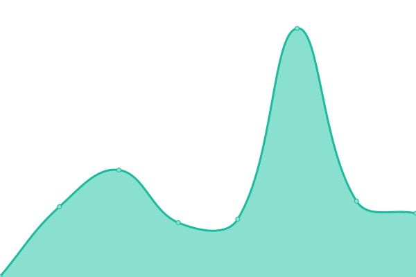
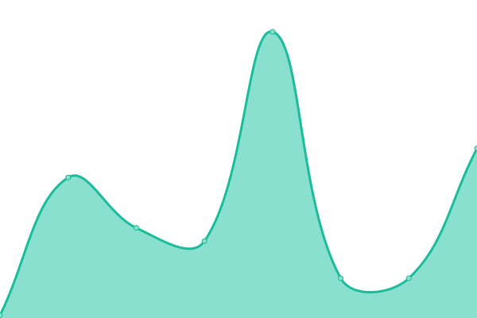
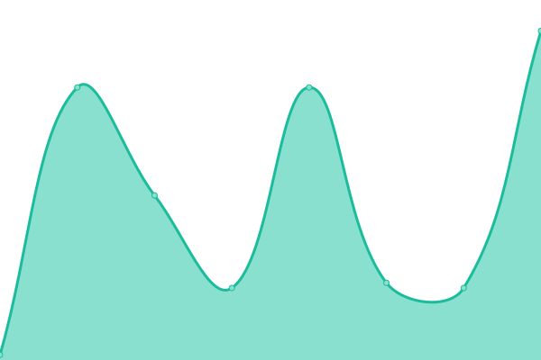

# [📈 Live Status](https://quickcode-ai.github.io/quickcode-status/): <!--live status--> **🟩 All systems operational**

This repository contains the open-source uptime monitor and status page for [Quickcode](https://quickcode-ai.github.io/quickcode-status/), powered by [Upptime](https://github.com/upptime/upptime).

With [Upptime](https://upptime.js.org), you can get your own unlimited and free uptime monitor and status page, powered entirely by a GitHub repository. We use [Issues](https://github.com/upptime/upptime/issues) as incident reports, [Actions](https://github.com/quickcode-ai/quickcode-status/actions) as uptime monitors, and [Pages](https://quickcode-ai.github.io/quickcode-status/) for the status page.

<!--start: status pages-->
<!-- This summary is generated by Upptime (https://github.com/upptime/upptime) -->
<!-- Do not edit this manually, your changes will be overwritten -->
<!-- prettier-ignore -->
| URL | Status | History | Response Time | Uptime |
| --- | ------ | ------- | ------------- | ------ |
|  [Quickcode Homepage](https://quickcode.ai) | 🟩 Up | [quickcode-homepage.yml](https://github.com/quickcode-ai/quickcode-status/commits/HEAD/history/quickcode-homepage.yml) | 

 747ms
     
 | 

<a href="https://quickcode-ai.github.io/quickcode-status/history/quickcode-homepage">100.00%</a>
    

|  [Quickcode](https://hs.quickcode.ai) | 🟩 Up | [quickcode-product.yml](https://github.com/quickcode-ai/quickcode-status/commits/HEAD/history/quickcode-product.yml) | 

 269ms
     
 | 

<a href="https://quickcode-ai.github.io/quickcode-status/history/quickcode-product">100.00%</a>
    

|  [Quickcode Auth](https://hs.quickcode.ai/auth/) | 🟩 Up | [quickcode-auth.yml](https://github.com/quickcode-ai/quickcode-status/commits/HEAD/history/quickcode-auth.yml) | 

 38ms
     
 | 

<a href="https://quickcode-ai.github.io/quickcode-status/history/quickcode-auth">100.00%</a>
    

|  [QCTC](https://qc.quickcode.ai) | 🟩 Up | [qctc-product.yml](https://github.com/quickcode-ai/quickcode-status/commits/HEAD/history/qctc-product.yml) | 

 310ms
     
 | 

<a href="https://quickcode-ai.github.io/quickcode-status/history/qctc-product">100.00%</a>
    

|  [QCTC Auth](https://qc.quickcode.ai/auth/) | 🟩 Up | [qctc-auth.yml](https://github.com/quickcode-ai/quickcode-status/commits/HEAD/history/qctc-auth.yml) | 

 139ms
     
 | 

<a href="https://quickcode-ai.github.io/quickcode-status/history/qctc-auth">100.00%</a>
    

<!--end: status pages-->

[**Visit our status website →**](https://quickcode-ai.github.io/quickcode-status/)

## 📄 License

- Powered by: [Upptime](https://github.com/upptime/upptime)
- Code: [MIT](./LICENSE) © [Upptime](https://upptime.js.org)
- Data in the `./history` directory: [Open Database License](https://opendatacommons.org/licenses/odbl/1-0/)
